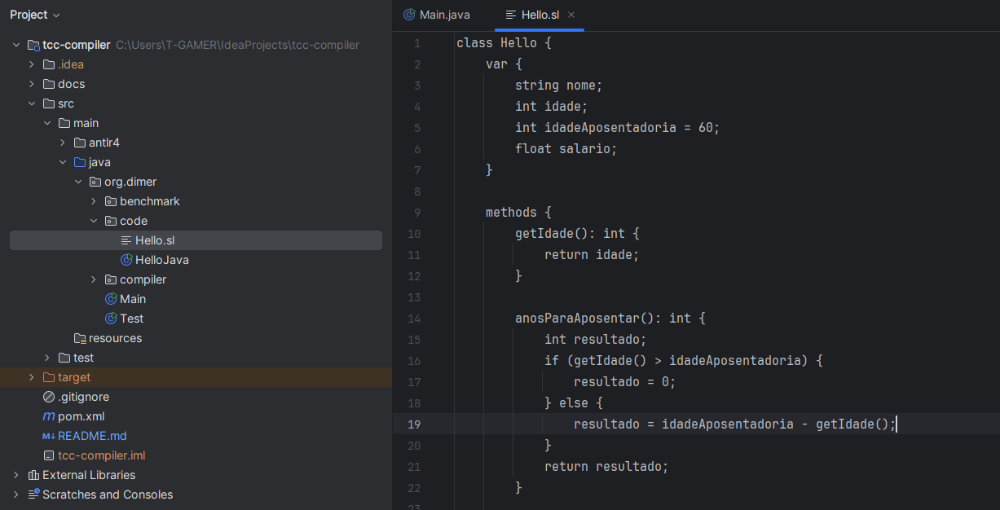
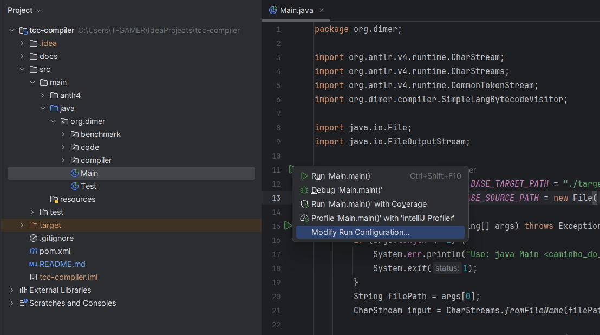
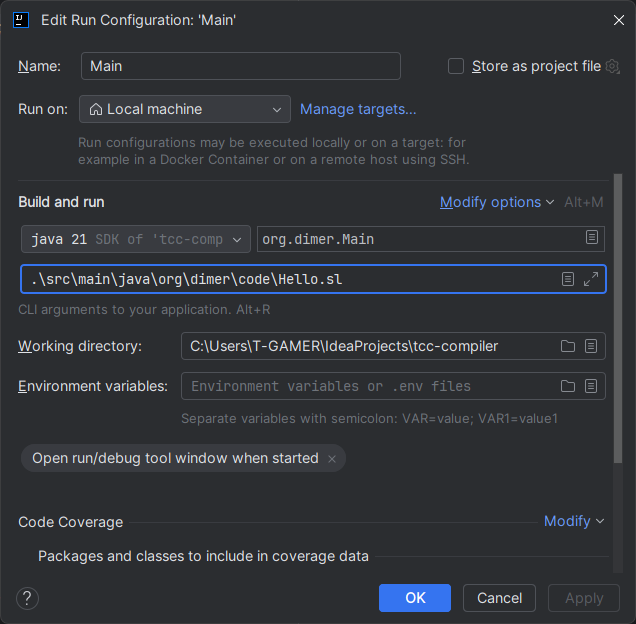
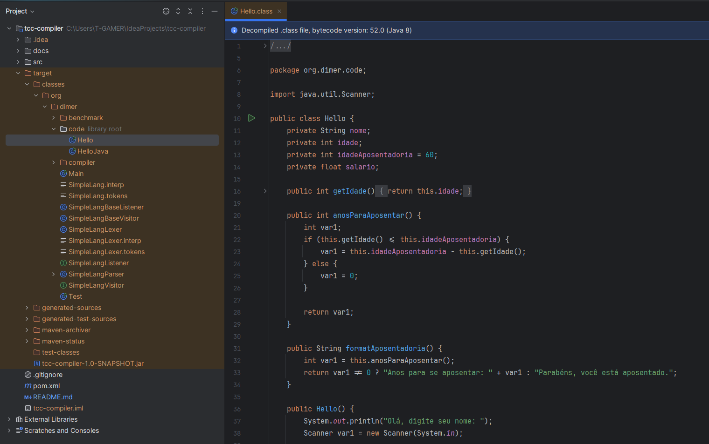
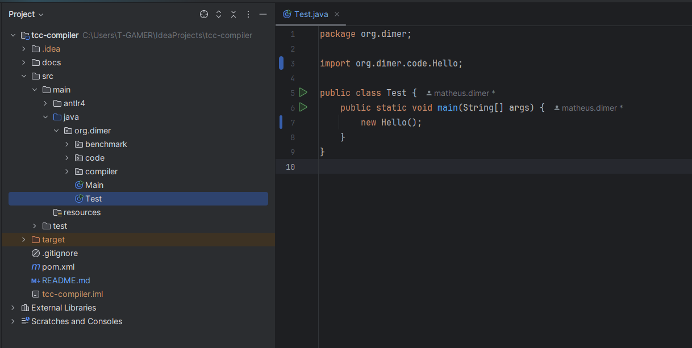

# Compilador SimpleLang

Esse projeto trata-se de um compilador funcional para uma nova linguagem de programação da JVM, chamada de SimpleLang.
Você pode conferir um código de exemplo em `./src/main/java/org/dimer/code/Hello.sl`

## Compilação

 - Versão Java: 21

Dê preferência para abrir esse projeto com a IDE IntelliJ da JetBrains.
Para compilar o projeto, execute `mvn install` pela IDE ou por linha de comando.

## Utilização:

Para usá-lo utilize o arquivo de código-fonte de SimpleLang disponível em `./src/main/java/org/dimer/code/Hello.sl`. 
Então, execute a classe `src/main/java/Main` do projeto passando como primeiro argumento o caminho para o arquivo de código-fonte.



Pelo IntelliJ, vá para a classe `Main`, clique no botão de executar e em seguida em Modify run configuration:



Então, em `program arguments` coloque o caminho para o arquivo `Hello.sl`:



Após isso, basta executar. O compilador irá salvar a classe compilada em `target/classes/<pacote>` conforme o pacote onde está o código, nesse caso
`org.dimer.code`.



Para executar o programa compilado, há duas maneiras:

* Executar a classe src/main/java/Test dentro do projeto, que faz referência para a classe compilada (retirando os comentários);
  

* Ou executar diretamente via linha de comando: 
    ```bash
    cd target/classes
    java org.dimer.code.Hello
    ``` 
